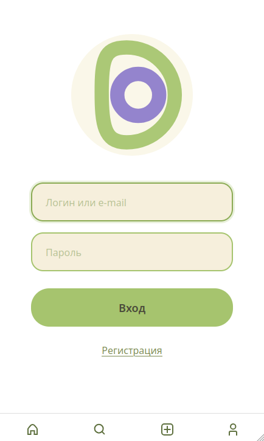
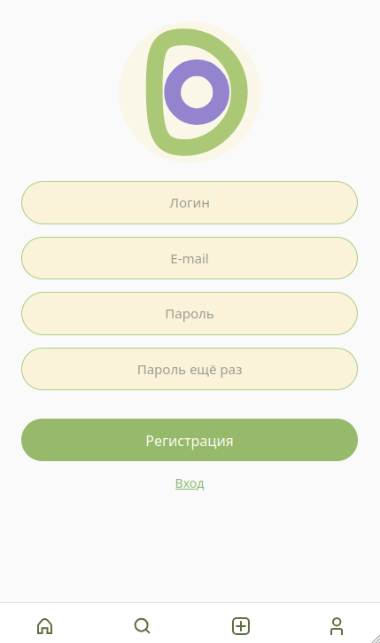
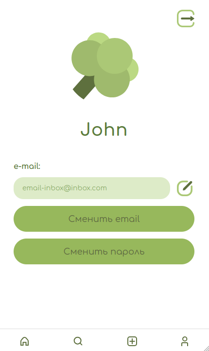
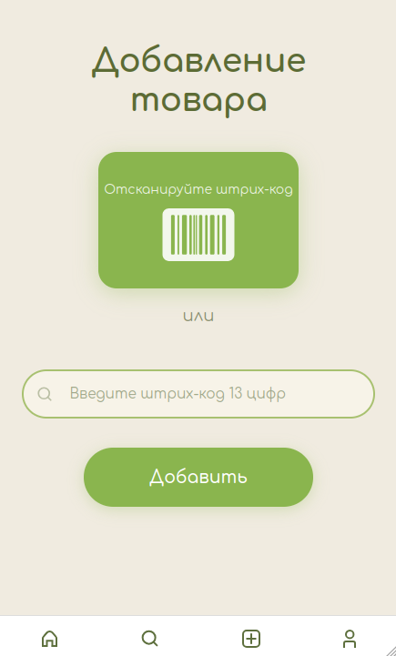
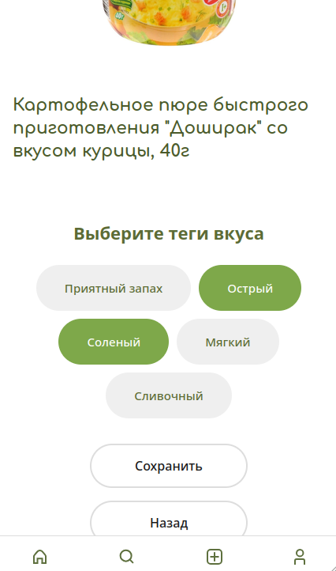
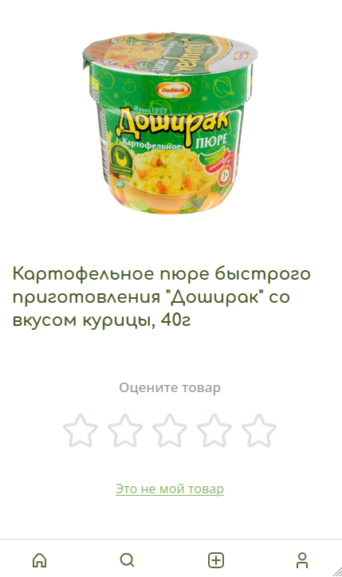
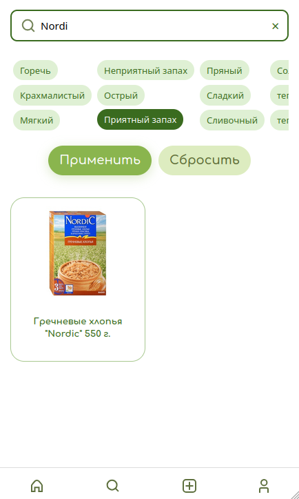
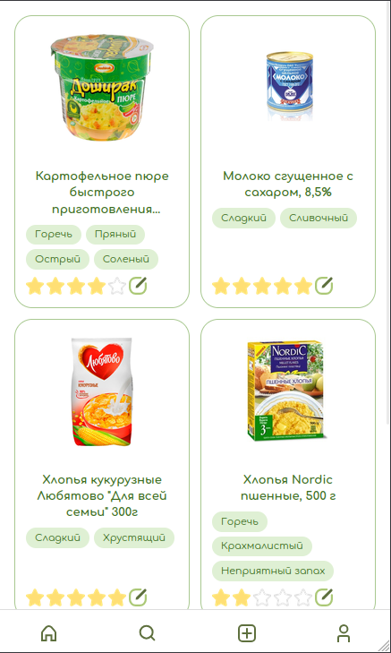

# Dish Oracle 🍽️

A Django-based web app to organize and rate grocery products by personal taste tags, with personalized recommendations coming in future updates.

---

## ✨ Highlights

- **99% test coverage** (3217 statements, only 48 uncovered) — core business logic is covered by automated tests using `pytest` and `pytest-django`.
- **Modular architecture** — each feature lives in its own Django app (`food_hub`, `search_hub`, `add_food`, `rate_food`, `accounts`), making it straightforward to extend with new functionality without touching unrelated code.

---
## 📱 Screenshots

<table>
<tr>
<td align="center"><b>Login</b></td>
<td align="center"><b>Registration</b></td>
<td align="center"><b>Profile</b></td>
<td align="center"><b>Add product</b></td>
</tr>
<tr>
<td></td>
<td></td>
<td></td>
<td></td>
</tr>
<tr>
<td align="center"><b>Taste tags</b></td>
<td align="center"><b>Rate product</b></td>
<td align="center"><b>Search &amp; filters</b></td>
<td align="center"><b>Catalog</b></td>
</tr>
<tr>
<td></td>
<td></td>
<td></td>
<td></td>
</tr>
</table>

---

## 🚀 Getting Started

Follow these steps to get a local development copy up and running.  
See **Deployment** for running in production.

---

## 🧰 Prerequisites
You'll need:
- Python 3.11+
  > On Linux/macOS the command may be `python3` instead of `python`,
  > depending on your system setup.
- pip
- Git
- Virtualenv *(optional but recommended)*
- Docker + Docker Compose
- PostgreSQL (used in Docker by default)
- Redis (used in Docker by default)

---

## ⚙️ Installation

### 1. Clone the repository
```bash
git clone https://github.com/Mark-s0l/dish-oracle.git
cd dish-oracle
```

### 2. Create and activate virtual environment
```bash
python -m venv venv
# or, if `python` is not found:
python3 -m venv venv
source venv/bin/activate   # Linux/macOS
venv\Scripts\activate      # Windows
```

### 3. Install dependencies
```bash
pip install -r requirements.txt
```

### 4. Create your environment file
```bash
cp .env.example .env
```
Then open `.env` and set your own `SECRET_KEY`, `DB_NAME`, `DB_USER`, `DB_PASSWORD`, etc.

### 5. Build and start Docker containers

This project uses a custom PostgreSQL image with Russian locale (`ru_RU.UTF-8`)
support, built automatically from the `Dockerfile` in the repository root.

```bash
docker compose up -d --build
```

This will start the **PostgreSQL** and **Redis** containers configured via your `.env`.

> `--build` ensures the image is rebuilt if the Dockerfile changes.
> For routine restarts without Dockerfile changes, plain `docker compose up -d` is enough.

### 6. Apply migrations and run the server

```bash
python manage.py migrate
python manage.py runserver
```

The app should now be available at:  
👉 http://127.0.0.1:8000

In a separate terminal, start the Celery worker (also required, uses the same venv):

```bash
source venv/bin/activate
celery -A dish_oracle worker -l info
```
---

## 🧩 Using the App

You can now:

- Add a product via its **13-digit EAN barcode**
- Rate it with **custom tags** (e.g. *Sweet, Spicy, Plastic, Would eat again*)
- Re-rate existing products
- Filter products by **tags** or search by **name**, **company**, **category**
- Change account email and password

---

## 🔌 External API

This project uses the [EAN-DB API](https://ean-db.com) to fetch product data by barcode.

You can use the same public API for your own instance — the settings format matches `.env.example` exactly:

```env
EAN_DB_API_URL=https://ean-db.com/api/v2/product/
EAN_DB_JWT=YOUR_JWT_TOKEN
```

Get your JWT token by registering at [ean-db.com](https://ean-db.com).

---

## 🛠️ Development

  

Install development dependencies first (if not already installed):

```bash
pip install -r requirements-dev.txt
```

  

### Running tests

```bash
pytest
```

Or for a specific app:

```bash
pytest [app_name]
```

  

With coverage report:

```bash
pytest --cov
```

  

### Linting and formatting

```bash
black .

isort .

flake8
```
---

## 🌍 Deployment

To run this on a live server:

- Set `DEBUG=False` in `.env`
- Set valid `ALLOWED_HOSTS`
- Set a new, production-only `SECRET_KEY` (do not reuse the one from `.env.example`)
- Configure SMTP settings for sending emails — **required**, the deploy check will fail without them
- Set `CSRF_TRUSTED_ORIGINS` for your domain (needed because of HTMX cross-origin requests)
- Configure HTTPS via Nginx (e.g. Let's Encrypt) and enable `SECURE_SSL_REDIRECT`, `SESSION_COOKIE_SECURE`, `CSRF_COOKIE_SECURE`
- Set up production logging (avoid the default console-only config)
- Configure Redis for production (persistence settings, separate instance from dev)
- Use a separate, production `EAN_DB_JWT` token
- Set up regular PostgreSQL backups
- Run Django with **Gunicorn** or **uWSGI** behind **Nginx**
- Configure static files with `collectstatic`

**Before deploying, always run:**

```bash
python manage.py check --deploy
```

This runs the project's deployment checks (including required SMTP configuration) and will report errors for any missing settings.

---

## 🧱 Built With

- [Django](https://www.djangoproject.com/)
- [django-environ](https://github.com/joke2k/django-environ)
- [django-htmx](https://github.com/adamchainz/django-htmx)
- [django-redis](https://github.com/jazzband/django-redis)
- [PostgreSQL](https://www.postgresql.org/)
- [Redis](https://redis.io/)
- [Docker](https://www.docker.com/)
- [Requests](https://requests.readthedocs.io/)
- [Pillow](https://pillow.readthedocs.io/)
- [python-stdnum](https://github.com/arthurdejong/python-stdnum)

---

## 🤝 Contributing

Pull requests are welcome!  
For major changes, open an issue first to discuss what you’d like to modify.

---

## 🔖 Versioning

This project follows [SemVer](https://semver.org/).  
Current release: `v1.0.0`

---

## 👤 Authors

- [@Mark-s0l](https://github.com/Mark-s0l) — initial design, backend, and project idea.  
See also the list of [contributors](https://github.com/Mark-s0l/dish-oracle/graphs/contributors).
